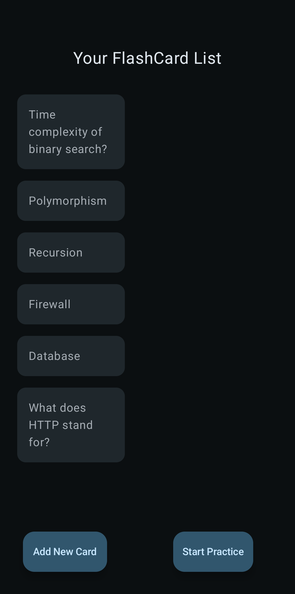
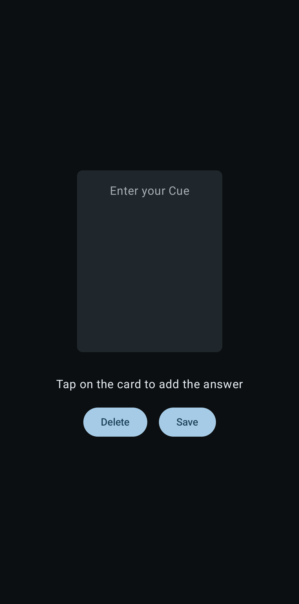
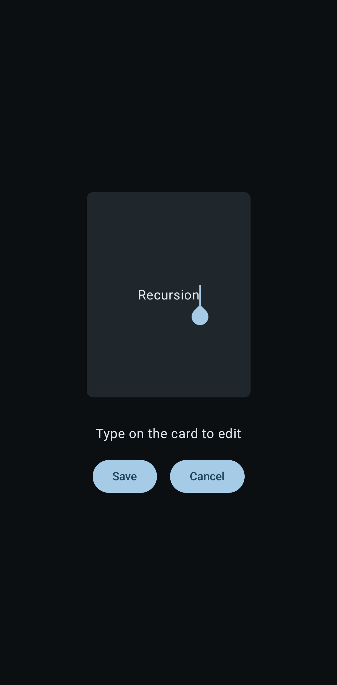
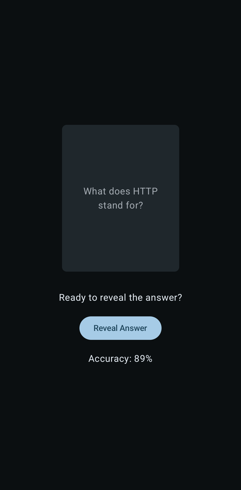
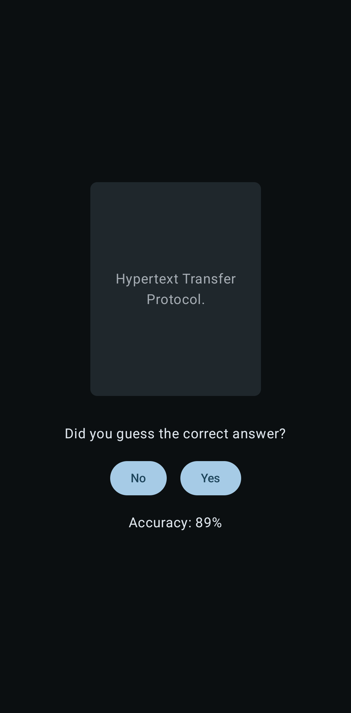
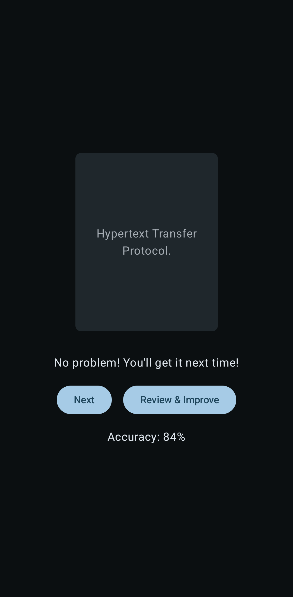
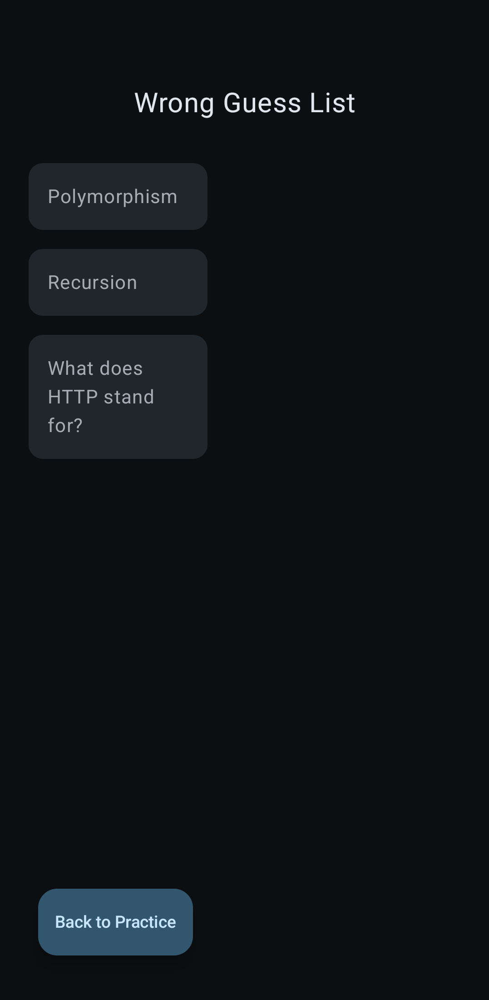
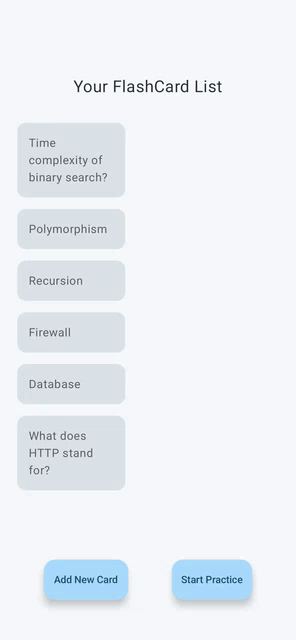
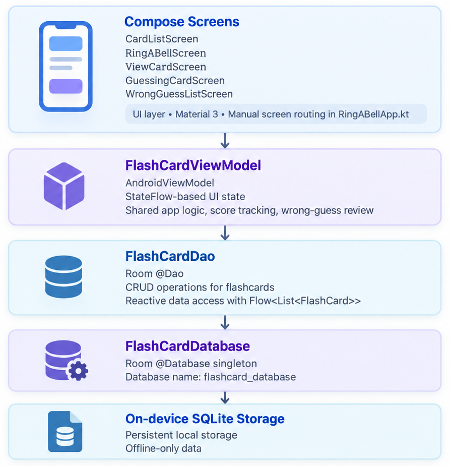

<!-- PLACEHOLDER: Add app icon/banner image here -->


# Ring a Bell?

A lightweight, offline flashcard app for creating, practicing, and tracking recall — built entirely with Jetpack Compose and Room.


> Build status and release-version badges are omitted — this repository has no CI workflow and no tagged releases yet.

## Table of Contents

- [Overview](#overview)
- [Preview](#preview)
- [Demo](#demo)
- [Features](#features)
- [Tech Stack & Architecture](#tech-stack--architecture)
  - [Architecture Diagram](#architecture-diagram)
- [Getting Started](#getting-started)
- [Permissions](#permissions)
- [Project Structure](#project-structure)
- [Testing](#testing)
- [Contributing](#contributing)
- [License](#license)
- [Acknowledgments](#acknowledgments)

## Overview

Ring a Bell? is a minimal, single-user flashcard app for anyone who wants to build a custom deck of cue/answer cards and drill their own recall — students memorizing terms, language learners, or anyone studying for a test. There are no accounts, no network calls, and no ads: every card is created and stored locally on the device with Room, and practice sessions track your accuracy and let you review the cards you got wrong.

## Preview

<table>
  <tr>
    <td align="center" width="33%">
      <br />
      <sub><b>Card List</b><br />Browse saved cards</sub>
    </td>
    <td align="center" width="33%">
      <br />
      <sub><b>Create Card</b><br />Add a new cue &amp; answer</sub>
    </td>
    <td align="center" width="33%">
      <br />
      <sub><b>Edit Card</b><br />Update or delete a card</sub>
    </td>
  </tr>
</table>

<table>
  <tr>
    <td align="center" width="50%">
      <br />
      <sub><b>Practice — Question</b><br />Reveal the answer when ready</sub>
    </td>
    <td align="center" width="50%">
      <br />
      <sub><b>Practice — Self-Grade</b><br />Mark yourself right or wrong</sub>
    </td>
  </tr>
</table>

<table>
  <tr>
    <td align="center" width="50%">
      <br />
      <sub><b>Review Prompt</b><br />Jump into review after a miss</sub>
    </td>
    <td align="center" width="50%">
      <br />
      <sub><b>Wrong Guess List</b><br />Revisit every missed card</sub>
    </td>
  </tr>
</table>

## Demo

<p align="center">
  
</p>

## Features

- Create flashcards with a cue and an answer, entered on a tap-to-flip card
- Browse all saved cards in a scrollable list
- View, edit, and delete existing cards, with a confirmation prompt before delete
- Practice mode draws a random card, lets you reveal the answer, and self-grade it Yes/No
- Running accuracy percentage calculated from your correct/incorrect self-grades
- Automatic "wrong guess" review list of cards you marked incorrect, which a card leaves once you answer it correctly again
- In-app back navigation between screens (hardware/gesture back button supported)
- Material 3 theming with dynamic color on Android 12+ (API 31+) and dark theme support
- Fully offline — no network access, no accounts, no ads

## Tech Stack & Architecture

| Layer | Choice |
|---|---|
| Language | Kotlin 2.2.10 (100% Kotlin, no Java) |
| UI | Jetpack Compose (Material 3), no XML layouts |
| State / DI | `AndroidViewModel` + Kotlin `StateFlow`/`Flow` (no Hilt/Dagger) |
| Persistence | Room 2.8.4 (`room-runtime`, `room-ktx`, KSP-generated `room-compiler`) |
| Async | Kotlin Coroutines & Flow |
| Build | Gradle 9.6.0, Android Gradle Plugin 9.2.1, KSP 2.2.10-2.0.2 |
| Navigation | None — manual `when`-based screen routing |
| Networking | None |

**Architecture:** the app follows a lightweight, single-module MVVM pattern rather than a formal layered/Clean Architecture. One `FlashCardViewModel` is shared across every screen (via the default `viewModel()` factory) and calls the Room `FlashCardDao` directly — there is no Repository layer and no dedicated `data`/`domain`/`presentation` package split. UI state lives either in the ViewModel's `StateFlow`s (card list, wrong-guess list, running score) or as local `remember { mutableStateOf(...) }` state inside each Composable. Screen-to-screen navigation is a hand-rolled `when(currentScreen: String)` switch in `RingABellApp.kt`, paired with a `BackHandler` for back-press routing — there is no Navigation Component dependency.

### Architecture Diagram

<p align="center">
  
</p>

## Getting Started

### Prerequisites

- Android Studio compatible with AGP 9.2.1 and Gradle 9.6 (a recent stable release channel)
- JDK 21 (the Gradle daemon toolchain pinned in `gradle/gradle-daemon-jvm.properties`)
- Android SDK Platform 36 (targetSdk) with a device/emulator running API 24 (minSdk) or higher

### Clone the repository

```bash
git clone https://github.com/PrathamSarker/ring-a-bell.git
cd ring-a-bell
```

### Open in Android Studio

Open the cloned folder in Android Studio and let it sync Gradle. No manual project configuration is required.

### Configuration

No configuration is needed to build or run this project:

- No API keys or secrets are used
- No `google-services.json` or Firebase setup is required
- No release signing config is defined (release builds are currently unsigned)
- `local.properties` only needs the standard `sdk.dir` entry, which Android Studio generates automatically on first sync

### Build & run

**Via Android Studio:** select the `app` run configuration and click Run.

**Via command line:**

```bash
# Build a debug APK
./gradlew assembleDebug

# Build and install on a connected device/emulator
./gradlew installDebug
```

## Permissions

`AndroidManifest.xml` declares **no permissions**. Ring a Bell? is fully offline — it doesn't access the network, camera, storage, notifications, or location — so no runtime or install-time permission is requested.

## Project Structure

```
app/src/main/java/com/example/ringabell/
├── MainActivity.kt             # Single Activity host, calls setContent { RingABellApp() }
├── RingABellApp.kt             # Top-level composable; manual string-based screen router + BackHandler
├── FlashCard.kt                # Room @Entity — flashcard table (id, Cue, Answer)
├── FlashCardDao.kt             # Room @Dao — insert/delete/query cards as Flow<List<FlashCard>>
├── FlashCardDatabase.kt        # Room @Database singleton ("flashcard_database")
├── FlashCardViewModel.kt       # AndroidViewModel — card list, wrong-guess list, score/accuracy logic
├── CardListScreen.kt           # Screen: browse saved cards, entry points to create/practice
├── RingABellScreen.kt          # Screen: create a new card (flip-card input UI)
├── ViewCardScreen.kt           # Screen: view/edit/delete an existing card
├── GuessingCardScreen.kt       # Screen: practice mode — random draw, reveal, self-grade
├── WrongGuessListScreen.kt     # Screen: review cards marked incorrect during practice
└── ui/theme/
    ├── Color.kt                 # Material 3 color definitions
    ├── Theme.kt                 # RingABellTheme — dynamic color + dark theme support
    └── Type.kt                  # Typography definitions
```

## Testing

```bash
# Unit tests (JVM, app/src/test)
./gradlew test

# Instrumented tests (device/emulator required, app/src/androidTest)
./gradlew connectedAndroidTest
```

The project currently ships only the default Android Studio template tests (`ExampleUnitTest`, `ExampleInstrumentedTest`) as placeholders. JUnit4, Espresso, and Compose UI testing dependencies are already wired into `app/build.gradle.kts`, so real unit and Compose UI tests can be added without further setup.

## Contributing

This is a personal project, but contributions are welcome:

1. Fork the repository
2. Create a feature branch (`git checkout -b feature/your-feature`)
3. Commit your changes with a clear, conventional message (e.g. `fix: correct accuracy calculation`)
4. Push to your fork and open a pull request describing the change and why it's needed

## License

No `LICENSE` file is currently included in this repository. Until one is added, all rights are reserved by the author. If you're the maintainer and intend to open-source this project, consider adding a `LICENSE` file (e.g. MIT or Apache 2.0) to clarify how others may use, modify, and distribute the code.

## Acknowledgments

<!-- PLACEHOLDER: author to fill in additional details -->

- **Author:** [PrathamSarker](https://github.com/PrathamSarker)
- **Contact:** sarkerpratham7@gmail.com 
